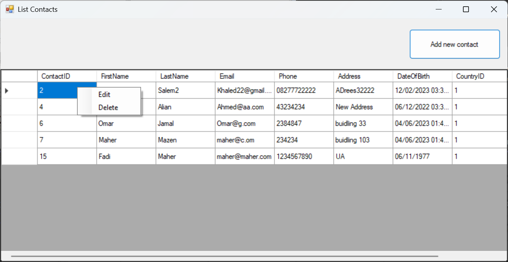
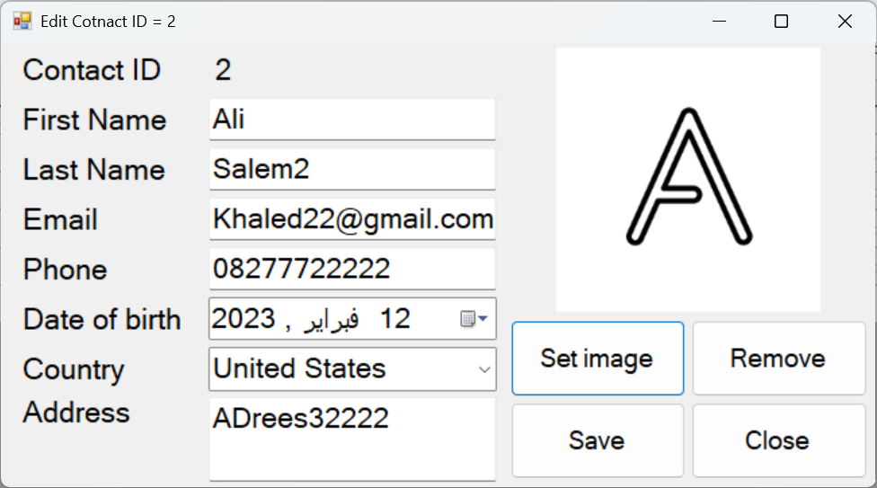
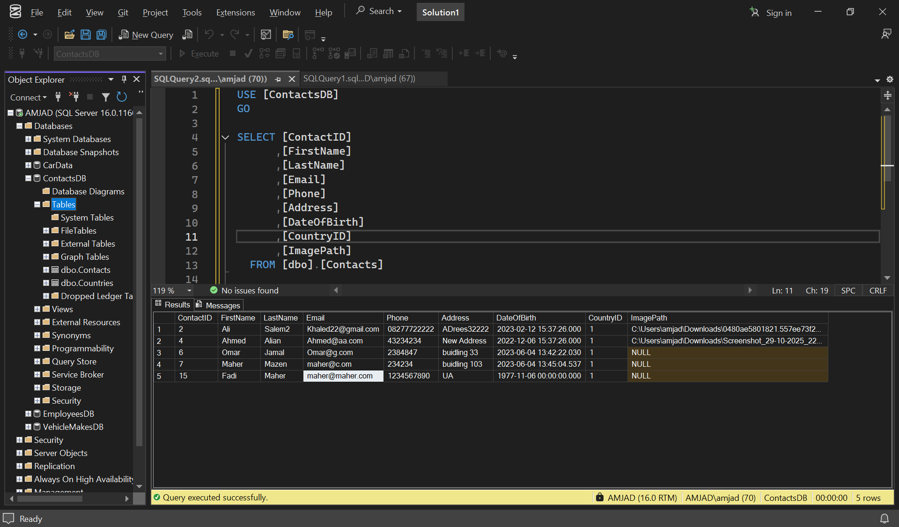

# Contacts WinForm Solution

## 📖 About
A project about **simple database user management** built to apply the **3‑Tier Architecture** in a programming course.  
It demonstrates separation of concerns between **Presentation**, **Business Logic**, and **Data Access** layers using C# and SQL Server.

---

## 🧱 Architecture Overview
- **ContactsWinFormSolution (Presentation Layer)**  
  Windows Forms application that provides the user interface for managing contacts.

- **ContactsBusinessLayer (Business Logic Layer)**  
  Contains validation, rules, and communication logic between the UI and the data layer.

- **ContactsDataAccessLayer (Data Layer)**  
  Handles SQL Server connectivity, queries, and CRUD operations for persistent storage.

---

## 🚀 Features
- Add, update, delete, and view contact records  
- Modular design with class libraries for reusability  
- Clear separation of responsibilities following 3‑Tier principles  
- SQL Server integration with stored procedures  

---

## 🛠️ Technologies
- **C# (.NET Framework / Windows Forms)**  
- **SQL Server**  
- **Visual Studio**  

---

## ▶️ Getting Started
1. Clone the repository:
   ```bash
   git clone https://github.com/amjad-jaloum/ContactsWinFormSolution.git
## 📸 Screenshots

<p align="center">
  
</p>

<p align="center">
  
</p>

<p align="center">
  
</p>
